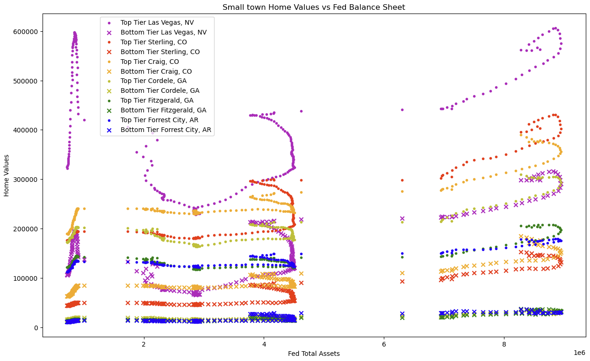

# Exploring relationships between real estate & financial indicators

## Shaolin AI Project 1 by Jim, Donny and Athen

### Our goal:
To gather, plot, and compare various data from the Federal Reserve, financial markets, and real estate markets to look for correlations and trends.
### Our first question:
Which indicators can most reliably correlate with housing prices?

### Hypothesis:
Macroeconomic indicators such as the Fed’s balance sheet will correlate with asset prices.
__________________________________________________________________________________

### The Process

1. **Gather:** Gather data, clean and organize it for visualization.
2. **Plot:** Plotting the data with python libraries to visually understand the relationships.
3. **Analyze:** Analyze the plots we produced to check for correlations and come up with further research to pursue.

__________________________________________________________________________________

### Data Sources

| Source      | Data Pulled |
| --------  | --- |
| [Yahoo API (yfinance)](https://pypi.org/project/yfinance/)      | SP500, Gold, Bond prices  |
| [Public Zillow Data](https://www.zillow.com/research/data/)     | Historical Real Estate Prices in various markets |
| [FRED API](https://fredhelp.stlouisfed.org/#fred-data-understanding-the-data) | Fed Balance Sheet, Effective Funds Rate, CPI, Corporate Liquid Assets  |
| [Public IRS Data](https://www.irs.gov/statistics/soi-tax-stats-individual-income-tax-statistics-zip-code-data-soi)       | Average Income by Zip Code    |

### Data Cleaning
Jim, Athen, and Donny used pandas to clean and organize the data. This included reading the data as a DataFrame, dropping nulls, dropping unneeded columns, formatting dates in DateTime format, transposing columns with rows, setting the indexes, and merging dataframes.

__________________________________________________________________________________
## Plotting Process
1. **Heatmaps:** We started by plotting several correlation heatmaps with Seaborn to confirm which assets and indicators are the most correlated.

2. **First Observation:** We quickly found a correlation between the S&P 500 and the Federal Reserve's Balance Sheet.

*The Fed Balance Sheet is effectively a measure of Quantitative Easing*
### What is Quantitative Easing (QE)?
- A monetary policy where a central bank, such as the Federal Reserve, commits to purchasing a set quantity of bonds or other assets to stimulate the economy. These bonds get added to the Fed’s Balance Sheet.
- This increases the supply of money and encourages the market to hold long term or risky assets instead of cash.
- In the US, QE as we know it began in 2008 after the Great Financial Crisis, and has mostly continued nonstop.
### More Correlations
3. **Corporate liquid assets are also correlated with the fed’s balance sheet:** This is a measure of how much liquid assets (such as cash, bonds and stocks) are owned by non-financial corporations.

4. **We found a moderate inverse correlation between Interest Rates and Real Estate:** When delayed by three years, interest rates show an inverse correlation with asset prices before the QE era (which is normal), but after after QE began the inverse correlation was suppressed.

5. **The Fed and Home Prices:** We plotted average home prices in ten major cities and compared them to the fed balance sheet. Starting in 2012, home values became highly correlated with the fed balance sheet. This chart is normalized, or scaled such that the y axis is equal on all plots.

### Once we were confident that QE highly correlates with financial assets, our next question was do any aspects of a home make it correlate higher or lower with QE?
6. **Highest and Lowest Home Prices of Six Major Cities, Plotted Against the Fed Balance Sheet:** This chart shows how some cities were more correlated to the Fed than others, especially in the top tier homes of LA, San Diego, and New York. The Great Financial Crisis occurred on the left side, when most home values experienced a blow off top. At that time we can see the market was more organic, in that the top tier homes of most cities were worth more than the bottom tier homes of most cities. Up to present day, the bottom tier homes of LA and San Diego gained more than the top tier homes of Las Vegas. For each city, Top Tier contains homes within the 65th and 95th percentile range, while Bottom Tier contains those within the 5th and 35th percentile. 

7. **Applying the same plot to smaller cities:** Using the smallest cities we could find that had data back to 2000, we ran them through the same analysis and included Las Vegas for scale. Many of these cities have a population between six and fifteen thousand. There are some outlier towns in Oregon and Colorado, but for the most part their growth was muted compared to major cities.

8. **Using Zillow and IRS data, we built scatter plots comparing the average income and average home value growth per zip code.** These charts are divided between eras to try and notice a difference in trends. The eras are Pre-GFC (2000-2007), GFC (2007-2012), The QE Era (2012-2022), and the current QT Era (2022-2023). Income data was from 2019.

Unfortunately there may be some missing data from the IRS, as there is a gap of data in income levels between 80k and 100k. 
While each era shows a useful range of home value gain or loss, there is no observable correlation between average income and the gain or loss per zip code. We also tried the same plots with nominal gain instead of percentage gain with no improvement.

9. **Finally, we used Tableau to plot on a map the average gain or loss per county:** This also points to location being a prominent factor in home value gain.

Again we divided the data between different eras. In each new era, we have data for more and more counties.

In each era there are interesting trends and counter trends to speculate on.

__________________________________________________________________________________
## Conclusion
We discovered multiple correlations between the data. We were unable to come up with a model that quantitatively predicts real estate prices on a more granular level than national, but we have multiple threads we could pull on with more time. The biggest factor appears to be location. We intended to use python to correlate home values with location but ran out of time.

**While the Fed's Balance Sheet has been a strong predictor of asset prices in the past decade, that is not guaranteed to be the case in the future.**

**There are two unique factors about our current era:**

1. Quantitative Easing as we know it didn't exist before 2008.
2. We experienced a period of historically low interest rates. Not only did this period define the 2010's, but it also capped off a four decade decline in interest rates. It is difficult to pick a similar economic environment in the past to compare to today.

**Factoring inflation into the mix complicates the pictures even more:**
